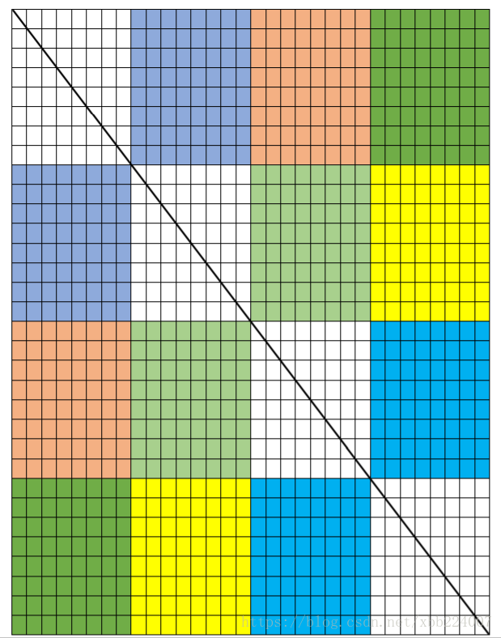
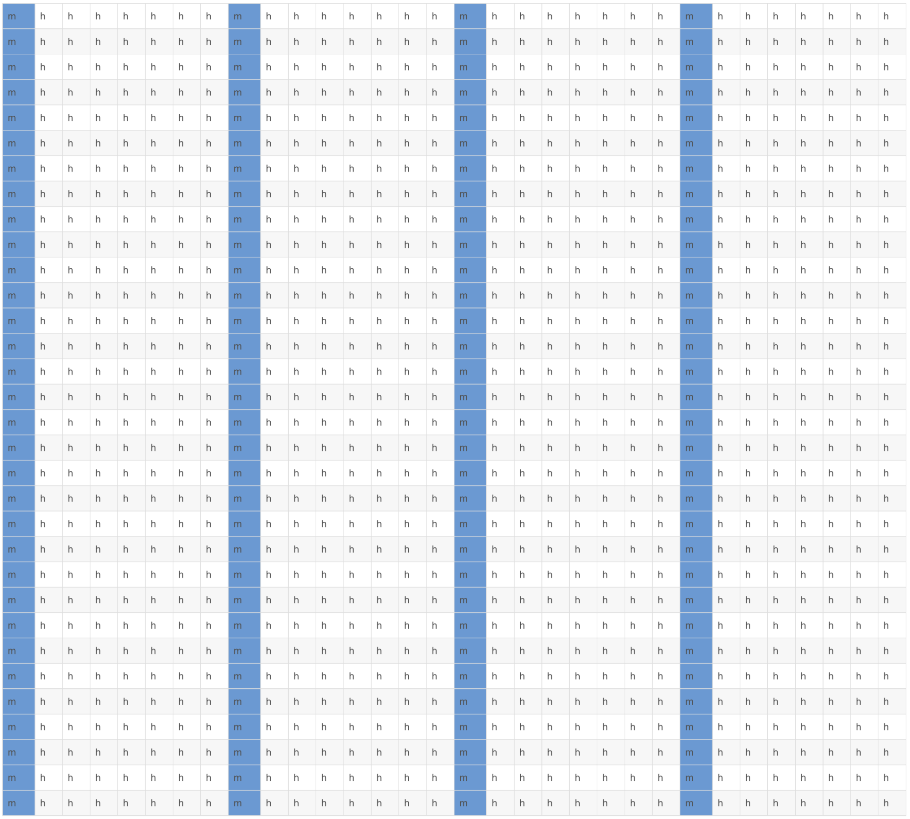
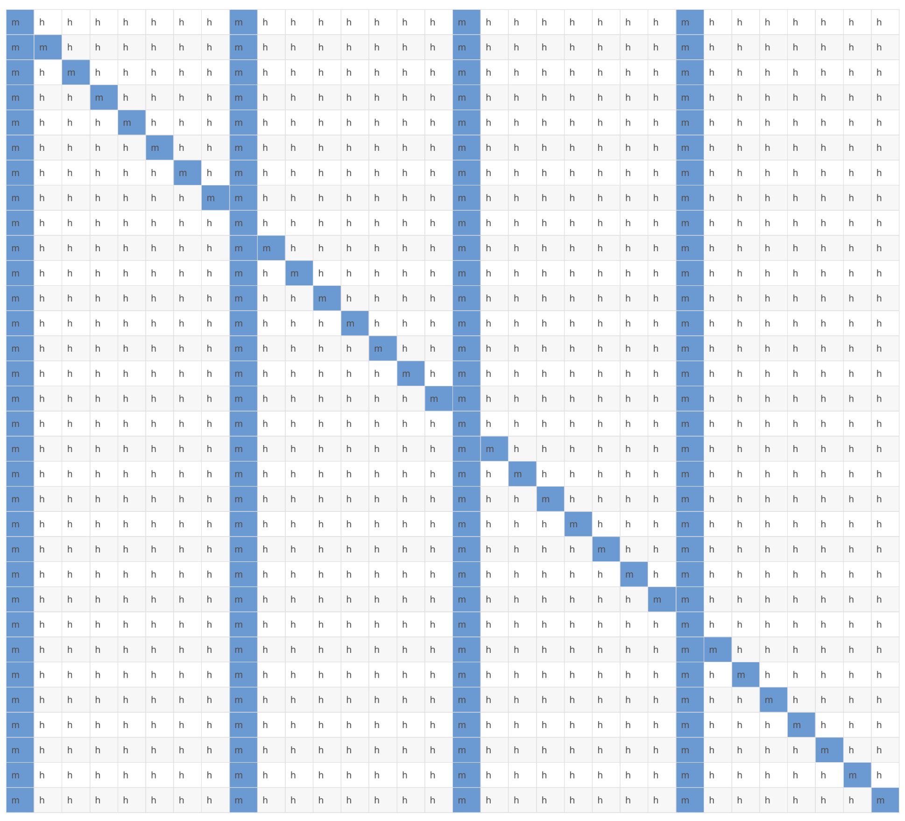
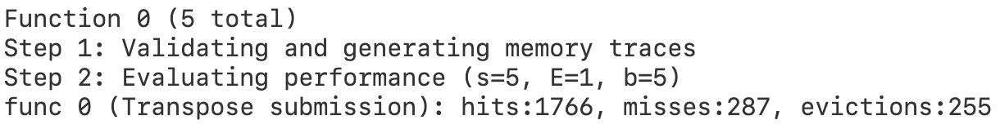
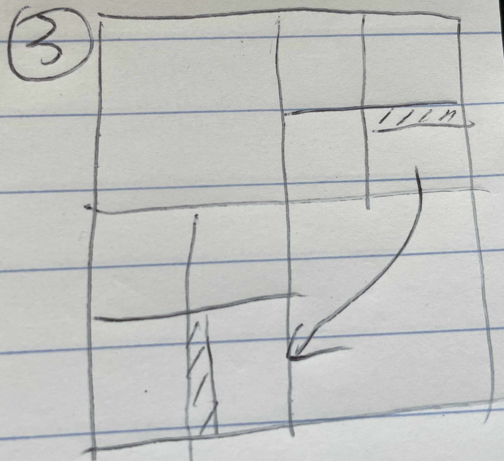
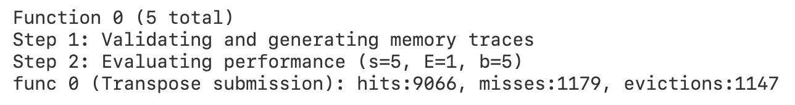
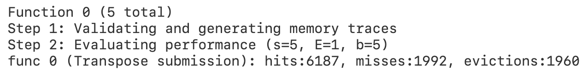

# Cache Lab: Understanding Cache Memories

# Part A: Writing a Cache Simulator
address = tag + set index + block offset  
S = 1 << s  
B = 1 << b  
E   
Set_Index = (address >> b) & (S - 1)  
Tag = address >> (s + b)  

# Part B: Optimizing Matrix Transpose
1 int = 4 bytes  
s = 5, E = 1, b = 5  
S = 32, total 32 sets  
B = 32, 1 block = 32 bytes = 8 ints  

4*4 matrix transpose cache result: [M4N4-result.txt](M4N4-result.txt)

## 32 * 32
32 ints in a row  
4 blocks = 1 row  
32 blocks / 4 blocks = 8  
at most 8 rows in cache  

For every 8*8 block, use 8 local variables to store 8 ints in one row.  
Then store these 8 ints in the corresponding column.  

Hit && Miss for A:

Hit && Miss for B:

Total miss: 32 * 4 + 32 * 4 + 28 = 284

**Result:**

## 64 * 64
64 ints in a row  
8 blocks = 1 row
32 / 8 = 4  
at most 4 rows in cache  
**1 block = 8 ints**
<table>
<tr>
<td></td> 
<td></td> 
<td></td>
</tr>
</table>

**Result:**

## 61 * 67

Use 16*16 block  

**Result:** 

# References
1. https://blog.csdn.net/xbb224007/article/details/81103995
2. https://blog.liuly.moe/posts/csapp-cache
